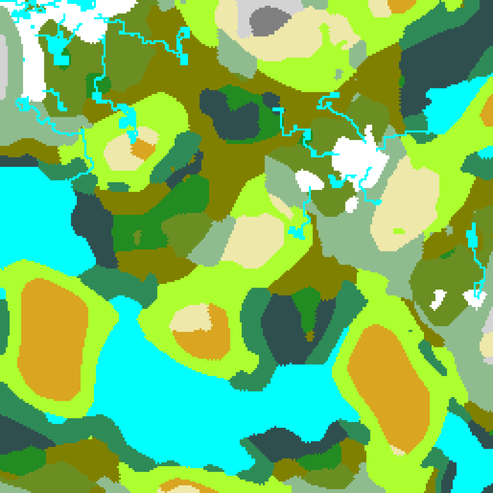

# Simple Terrain Generation libarary

A simple library to generate square tiled terrain maps written in F#.

## Description
This generator was written for my graduation thesis. It was designed to be cusomizable so that user could create new generation stages to generation process, implement other generation algorithmes and change the behaviour of already implmented and add then to generation pipeline.

Full text of the thesif may be found [here](https://docs.google.com/document/d/126BJCYGhhnuE0IectusJUO-FJPldX5hrDT6oTpYmpDE/edit?usp=sharing) (Russian only!).

## Available generation algorithms

- Simplex Noise (using this [package](https://github.com/WardBenjamin/SimplexNoise))
- Diamond-Square
- Cellular Automaton

## Terms

- Random map - two-dimensional array of floating point numbers in range from 0 to 1

## Example

```F#
let dsMap = DiamondSquare.generateMap 8 -90.85 72.12 -37.35 -30.59 256. 63281 Util.normalizeByAbs  

let snMap = SimplexNoise.generateMap 257 257 0.001f 63281 Util.normalizeBySlide  

let biomeGen = BiomeGeneration.generateBiomesFrom2DTable dsMap snMap   Util.to2DTableIndexMapper mapTable  

let snowCond _ _ elem = elem = Tiles.TerrainTile.Land(Tiles.LandTile.Snow)  

let riverGen = RiverGenerator.generateRivers
RiverGenerator.elevationMapRiverGenerator dsMap (RiverGenerator.minFlowChooser   RiverGenerator.isWater)) 30 snowCond 63281  

let cleaner = CellularAutomaton.generateMap 3   CellularAutomaton.eightTilesNeighborhoodWithoutCell   CellularAutomaton.chooseByMajority Util.doNotNormalize  

TerrainGen.generateTerrain (biomeGen, cleaner, riverGen)
```
This code snippet creates the map below


## List of methods

All available methods are broken down into packages

### Util

Collection of helper-functions

| Name | Description |
|------|-------------|
| shuffleList | Shuffle elements in list |
| generateDualWhiteNoise | Generate white noise of values 1 and 0 |
| generateWhiteNoise | Generate white noise of floating point number in range from 0 to 1 |
| normalizeByMinMax | Normalize two-dimensional array by two values |
| normalizeBySlide | Normalize two-dimensional array using min-max normalization |
| normalizeByAbs | Normalize two-dimensional array of absolute values using min-max normalization |
| doNotNormalize | Blank normalization function |
| to2DTableIndexMapper | Map value to index in table |
| foldiArray2D | Two-dimensional array folder function with indexes |

### SimplexNoise

_Random map_ generation using Simplex Noise algorithm

| Name | Description |
| ---- | ----------- |
| generateMap | Generate _random map_ using Simplex Noise |
| normalizeByZeroAndTwoFiftyFive | Normalize two-dimensional array using min-max normalization where min = 0, max = 255 |

### DiamondSquare

_Random map_ generation using Diamond-Square alogrithm

| Name | Description |
| ---- | ----------- |
| generateMap | Generate _random map_ using Diamond-Square |

### CellularAutomaton

_Random map_ generation using cellular automaton
- cell - value in two-dimensional array
- neighbourhood - all cells used to calculate cell's value

| Name | Description |
| ---- | ----------- |
| generateMap | Generate _random map_ using cellular automaton |
| eightTilesNeighborhoodWithCell | Choose cell's neighbourhood as 8 neighbouring cells with a middle cell |
| eightTilesNeighborhoodWithoutCell | Choose cell neighbourhood as 8 neighbouring cells without a middle cell |
| chooseByAverage | Choose cell's next value as average value of cells in neigbourhood |
| chooseByMajority | Choose cell's next value equal to state of most cells in neigbourhood |
| chooseByMajorityWithCorner | Choose cell's next value equal to state of most cells in neigbourhood, non-present cells equals to cornerValue |

### LandWaterSplice

Generate land-water map from _random map_ using a division border: all values below the division border are water tiles; values greater or equal than the division border are land tiles

| Name | Description |
| ---- | ----------- |
| landWater | Divide _random map_ on water and land biomes |
| calcFactorMean | Use mean value as a division border |
| calcFactorMed | Use median value as a division border |

### BiomeGeneration

Generate terrain with biomes from _random map_

- segment of biomes - a number line with biomes to be generated laid out on it. The more the square of a biome on line - the more frequently it will be generated. Neighbouring biomes on a line will be neighbouring on a map.
- table of biomes - a table with biomes in its cells. The more cells a biome occupies, the more frequently it will be generated. Neighbouring biomes in a table will be neighbouring on a map.


| Name | Description |
| ---- | ----------- |
| generateBiomesFromLandWaterMap | Generate terrain using LandWater map |
| generateBiomesFrom2DTable | Generate terrain using **table of biomes** |
| generateBiomesFromBiomeSegment | Genearate terrain using **segment of biomes** |

### RiverGenerator

Generate rivers using generated terrain.

- probability river generator - the next river tile is chosen using probability function. The longer river flows to one direction, the more probable this direction will be chosen next.
- ElevationMap river generator - river tiles are generated using the _random map_ of elevations.

| Name | Description |
| ---- | ----------- |
| probabilityRiverGenerator | Generate river using probability generator |
| logProbability | Logarithmic probability growth funtion |
| elevationMapRiverGenerator | Generate river using ElevationMap generator |
| maxFlowChooser | Choose cell with maximal value to be next |
| minFlowChooser | Choose cell with minimal value to be next |
| isWater | End river generation when water tile reached |
| isSnow | End river generation when snow tile reached |
| blankRiverGenerator | Do not generate rivers |
| generateRivers | Generate given number of rivers using given generator |
| generateNoRivers | Generate zero rivers |

### TerrainGeneration

Collection of high-level functions for terrain generation

| Name | Description |
| ---- | ----------- |
| TerrainGen.generateTerrain | Generate terrain |
| generateTerrainWith2DTableAndElevationMapBasedRiversFromSnowToWater | Generate terrain using **table of biomes** and ElevationMap river generator |
| generateTerrainWithLandWaterDivisionAndProbabilityRiverGenerator | Generate terrain using LandWater map and probability river generator |
| generateTerrainWithBiomeSegmentAndProbabilityRiverGenerator | Generate terrain using **segment of biomes** and probability river generator |

## Sources
- [Polygonal Map Generation for Games](http://www-cs-students.stanford.edu/~amitp/game-programming/polygon-map-generation/)
- [Secure Map Generation for Multiplayer, Turn-Based Strategy Games](https://digitalcommons.du.edu/cgi/viewcontent.cgi?article=1547&context=etd)